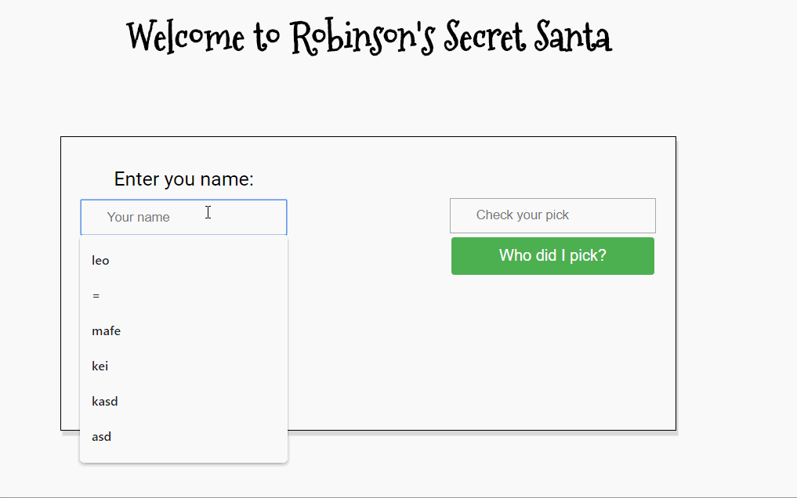

# SECRET SANTA

> Enter the name of all family members and then make the draw! To see who you pick, just enter your name and click on 'Who did I pick?' =)

> There must be at least 4 participants, because if there's 3 persons participating being 2 of them a couple, one of the couple will always draw the other one.

## Installation

Download all the dependencies

```sh
npm install
```

Start the application on your localhost:

```sh
npm start
```

## Usage example



## Testing

To run unit tests:

```sh
npm test
```

## Model

Model used MVC
Registration.js is responsible for adding the members to the draw
Matches.js matches the members and draw is made
Draw.js checks who is the draw of who
